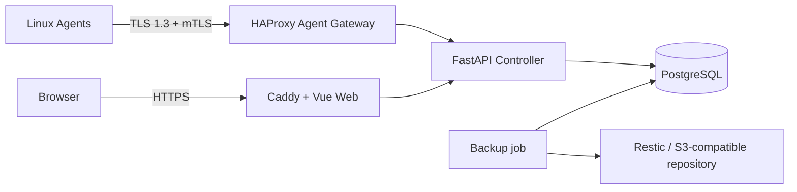

# VPS Guardian

VPS Guardian is a security-first control plane for monitoring, diagnosing, and recovering a fleet of Linux VPS hosts. It combines a FastAPI controller, PostgreSQL, a Vue operations dashboard, and a small Go agent with mutual TLS.

> This is an alpha release and is not yet recommended for production use.

[Chinese documentation](README.zh-CN.md) | [Quick start](docs/QUICKSTART.md) | [Architecture](docs/ARCHITECTURE.md) | [Security](SECURITY.md)

## Implemented in this alpha

- Controller, Web dashboard, PostgreSQL, and Linux Agent
- mTLS, RBAC, TOTP, CSRF protection, and login rate limiting
- Signed tasks, nonce replay protection, approvals, and append-only audit events
- Agent heartbeat, CPU and network metrics, and a durable offline queue
- Restic backup and restore with S3-compatible storage, including Cloudflare R2
- Operations Overview with hosts, topology, disaster recovery, security, alerts, and audit data

## Not complete

- Long-running validation across a large multi-VPS fleet
- End-to-end Telegram and email alert delivery
- Complete service-level monitoring coverage
- Fully automated approval and repair workflows
- Automatic rebuilding across cloud providers
- Production-grade public Internet deployment

## Architecture



## Requirements

- Linux host with Docker Engine 27+ and Docker Compose v2
- A DNS name for the dashboard and another for the Agent gateway
- Public ports 80/443 for the dashboard and the configured mTLS Agent port
- OpenSSL, Python 3, and standard POSIX shell tools for initialization
- 2 CPU cores, 4 GB RAM, and 20 GB free disk as a practical developer-preview baseline

## Quick start

```sh
git clone https://github.com/<your-account>/vps-guardian.git
cd vps-guardian
cp .env.example .env
# Edit .env and replace the example DNS names and ACME email.
sudo sh scripts/generate-controller-secrets.sh ./secrets agents.guardian.example.com
sudo sh scripts/prepare-compose-secrets.sh --secrets-dir "$(pwd)/secrets"
docker compose build
docker compose up -d
docker compose exec -it controller guardian-admin create-user
```

The last command prompts for the administrator email and hidden password. Never pass a password in a command argument. For automation, use an absolute root-only password file with `guardian-admin ensure-user --password-file` and remove it after the command succeeds.

Read [the full quick start](docs/QUICKSTART.md) before exposing any port. Agent enrollment is covered in [Agent installation](docs/AGENT_INSTALLATION.md).

## Upgrade and uninstall

For an alpha upgrade, read [CHANGELOG.md](CHANGELOG.md), back up PostgreSQL and the controller data, replace the checked-out release, rebuild versioned images, run migrations, and recreate only VPS Guardian services. Alpha upgrades may contain manual steps.

To uninstall, run `docker compose down` to keep named volumes. Permanently deleting volumes destroys database and controller state and must be a separate, explicit operator decision.

## License

VPS Guardian is licensed under Apache-2.0. Third-party packages and images retain their own licenses; see [THIRD_PARTY_NOTICES.md](THIRD_PARTY_NOTICES.md).
