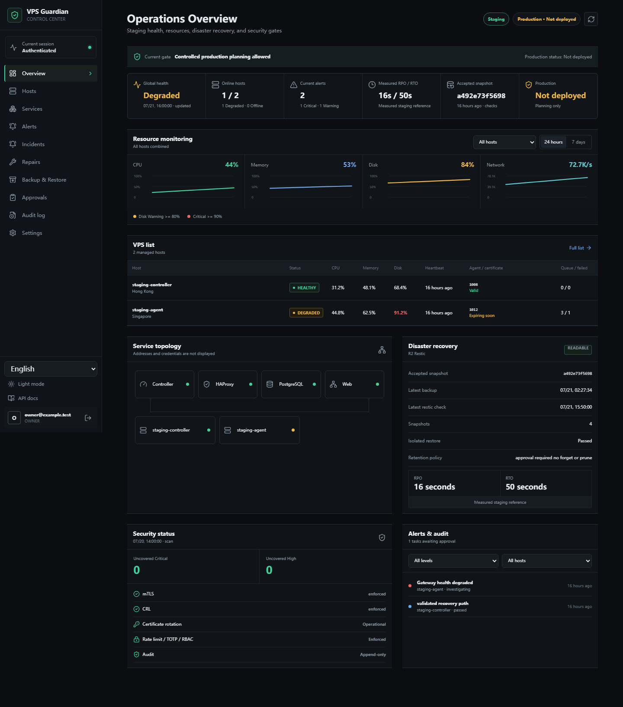
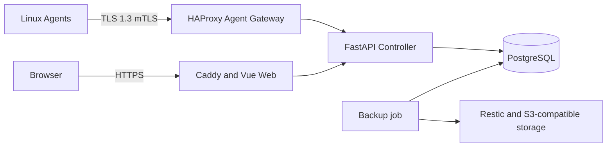

# VPS Guardian v0.2.0-alpha.1

[English](README.md) | [简体中文](README.zh-CN.md)

[](https://github.com/liumingxu0122-hue/vps-guardian/actions/workflows/ci.yml)
[](https://github.com/liumingxu0122-hue/vps-guardian/releases)
[](LICENSE)

VPS Guardian is a security-first control plane for monitoring, diagnosing, and recovering fleets of Linux VPS hosts. It combines a FastAPI Controller, PostgreSQL, a Vue operations dashboard, and a lightweight Go Agent secured with mutual TLS.

> **Alpha warning:** This is a Developer Preview and is not yet recommended for production use.



## Project status

| Area | Alpha capability | Status |
| --- | --- | --- |
| Control plane | FastAPI Controller and PostgreSQL state | Available |
| Managed hosts | Go Agent, multi-host inventory, service checks, metrics, and offline queue | Available |
| Operations UI | Responsive Overview with English and Simplified Chinese | Available |
| Disaster recovery | Restic with S3-compatible storage and isolated restore validation | Preview |
| Production readiness | Public deployment and sustained multi-VPS validation | Not complete |

## Features

- Controller, Web dashboard, PostgreSQL, and Linux Agent
- TLS 1.3 mTLS, RBAC, TOTP, CSRF protection, and login rate limiting
- Signed tasks, nonce replay protection, approvals, and append-only audit events
- Agent heartbeat, CPU and network metrics, and a durable offline queue
- Restic backup and restore with S3-compatible storage, including Cloudflare R2
- Operations Overview with hosts, topology, disaster recovery, security, alerts, and audit data
- Phase 4B multi-host inventory, service checks, persistent alert state, opt-in notifications, and approval-backed repairs
- English and Simplified Chinese UI, documentation, dates, numbers, durations, statuses, and errors

## Current limitations

- No sustained validation across a large multi-VPS fleet
- External Telegram, SMTP, and webhook delivery is opt-in; default tests use local mocks
- Enrollment still requires a pre-issued mTLS bundle; CSR bootstrap is planned
- No automatic cross-cloud rebuilding or production-grade public deployment
- Experimental Windows SSH dashboard launcher

## Architecture



Read the [architecture guide](docs/en/ARCHITECTURE.md) for trust boundaries, data flow, and component responsibilities, and the [Phase 4B operations guide](docs/en/PHASE4B.md) for monitoring workflows.

## Quick install

The practical preview baseline is Docker Engine 27+, Docker Compose v2, Git, OpenSSL, Python 3, two DNS names, 2 CPU cores, 4 GB RAM, and 20 GB free disk.

```sh
git clone https://github.com/liumingxu0122-hue/vps-guardian.git
cd vps-guardian
cp .env.example .env
sudo sh scripts/generate-controller-secrets.sh ./secrets agents.guardian.example.com
sudo sh scripts/prepare-compose-secrets.sh --secrets-dir "$(pwd)/secrets"
docker compose build && docker compose up -d
docker compose exec -it controller guardian-admin create-user
```

The final command securely prompts for the administrator email and hidden password. Never put a password in argv, `.env`, Git, or logs. Read the [complete quick start](docs/en/QUICKSTART.md) before exposing ports.

## Agent enrollment

Create the host inventory entry, generate a short-lived enrollment bundle through an authorized Controller workflow, install the architecture-specific Agent, and verify heartbeat, certificate serial, metrics, and offline queue. See [Agent installation](docs/en/AGENT_INSTALLATION.md).

## Dashboard access

Open `https://<GUARDIAN_DOMAIN>/overview`. Chinese browser locales select Simplified Chinese on first visit; other locales use English. The language selector persists an explicit choice. The Windows SSH launcher remains Experimental.

## Backup and restore

Use restricted secret files, a bucket-scoped identity, Restic checks, and isolated restores with file-count, SHA-256, schema, and critical-record validation. See [Backup and restore](docs/en/BACKUP_AND_RESTORE.md).

## Security design

TLS 1.3 mTLS, signed tasks, replay defense, RBAC, TOTP, CSRF protection, rate limiting, approvals, and audit reduce blast radius but do not replace host hardening. See the [security model](docs/en/SECURITY_MODEL.md) and [security policy](SECURITY.md).

## Roadmap

- Validate long-running operation across a larger multi-VPS fleet
- Add CSR-based enrollment bootstrap
- Complete isolated Nezha runtime benchmarks; unmeasured values remain `Pending`
- Add cross-cloud recovery workflows and production deployment guidance
- Publish a separate v0.3.0-alpha.1 only after Phase 4C staging acceptance

See the [Nezha study](docs/en/comparisons/NEZHA_STUDY.md) and [benchmark plan](docs/en/comparisons/NEZHA_BENCHMARK.md).

## Contributing

Read [CONTRIBUTING.md](CONTRIBUTING.md), keep changes scoped, add proportional tests, and never submit live infrastructure data or credentials.

## License

VPS Guardian is licensed under Apache-2.0. Third-party components retain their own licenses; see [THIRD_PARTY_NOTICES.md](THIRD_PARTY_NOTICES.md).
