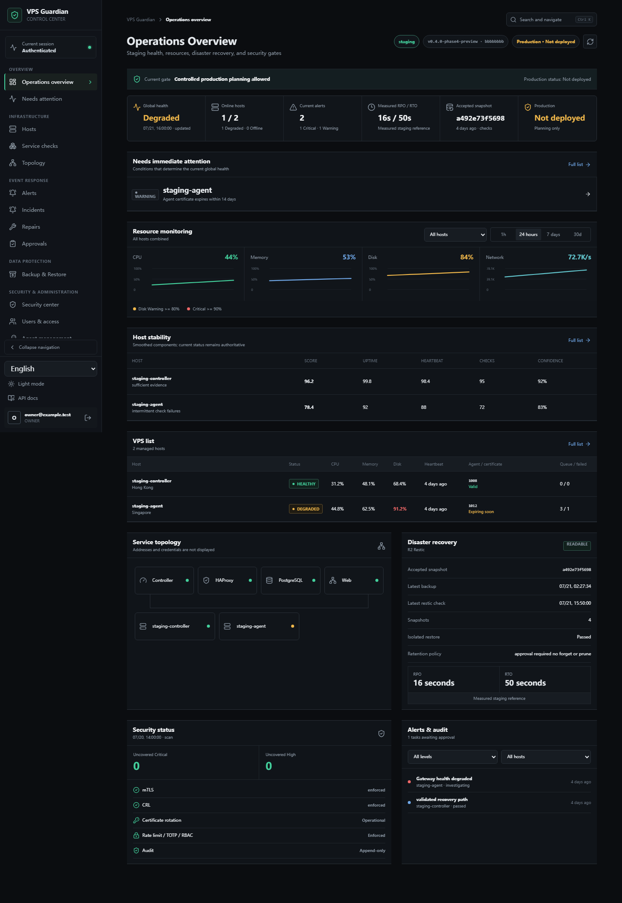
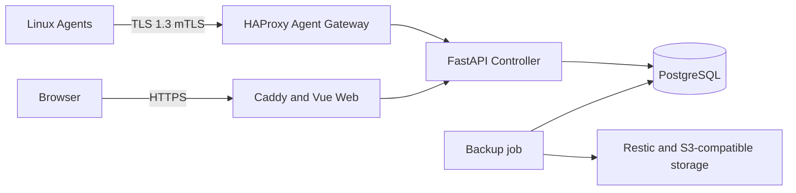

# VPS Guardian

[English](README.md) | [简体中文](README.zh-CN.md)

[](https://github.com/liumingxu0122-hue/vps-guardian/actions/workflows/ci.yml)
[](https://github.com/liumingxu0122-hue/vps-guardian/releases)
[](LICENSE)

VPS Guardian is a security-first control plane for monitoring, diagnosing, and recovering fleets of Linux VPS hosts. It combines a FastAPI Controller, PostgreSQL, a Vue operations dashboard, and a lightweight Go Agent secured with mutual TLS.

> **Alpha warning:** This is a Developer Preview and is not yet recommended for production use.



## Project status

| Area | Alpha capability | Status |
| --- | --- | --- |
| Control plane | FastAPI Controller and PostgreSQL state | Available |
| Managed hosts | Go Agent, multi-host inventory, service checks, metrics, and offline queue | Available |
| Operations UI | Phase 4 grouped console, Attention queue, workflows, English and Simplified Chinese | Preview |
| Disaster recovery | Restic with S3-compatible storage and isolated restore validation | Preview |
| Production readiness | Public deployment and sustained multi-VPS validation | Not complete |

## Features

- Controller, Web dashboard, PostgreSQL, and Linux Agent
- TLS 1.3 mTLS, RBAC, TOTP, CSRF protection, and login rate limiting
- Signed tasks, nonce replay protection, approvals, and append-only audit events
- Agent heartbeat, CPU and network metrics, and a durable offline queue
- Preview per-port RX/TX accounting with explicit data gaps, bounded PostgreSQL
  rollups, quota alerts, and approval-gated egress shaping
- Restic backup and restore with S3-compatible storage, including Cloudflare R2
- Decision-oriented Overview and Attention queue with explainable health, stability components, and deployment provenance
- Grouped responsive operations console for hosts, services, topology, alerts, incidents, repairs, approvals, recovery, security, users, Agents, notifications, audit, and settings
- Phase 4B multi-host inventory, service checks, persistent alert state, opt-in notifications, and approval-backed repairs
- Persistent alert assignment/closure, audited incident workflow, notification retry/dead-letter records, and structured check history
- Owner/Admin/Operator/Viewer role ceilings, optional narrowing scopes, reauthentication, and session revocation
- Host-bound CSR bootstrap with locally generated Agent keys and bounded certificate renewal
- English and Simplified Chinese UI, documentation, dates, numbers, durations, statuses, and errors

## Current limitations

- No sustained validation across a large multi-VPS fleet
- Per-port nftables/TC integration and 0/1/10/64-policy resource budgets still
  require isolated Linux Staging; the feature is disabled by default
- External Telegram, SMTP, Discord, and webhook delivery is opt-in; real two-channel closure remains pending
- Two-host CSR staging evidence is historical; current CRL handshake, rotation, and larger-fleet observation must be revalidated
- No automatic cross-cloud rebuilding or production-grade public deployment
- Experimental Windows SSH dashboard launcher

## Architecture


```mermaid
flowchart LR
  A[Linux Agents] -->|TLS 1.3 mTLS| G[HAProxy Agent Gateway]
  G --> C[FastAPI Controller]
  U[Browser] -->|HTTPS| W[Caddy and Vue Web]
  W --> C
  C --> P[(PostgreSQL)]
  B[Backup job] --> P
  B --> R[Restic and S3-compatible storage]
```

Read the [architecture guide](docs/en/ARCHITECTURE.md) for trust boundaries and data flow, the [Phase 4 completion guide](docs/en/PHASE4_COMPLETION.md) for the operational workflows and gates, and the [Phase 4C staging guide](docs/en/PHASE4C.md) for CSR bootstrap and validation status.

The optional port-traffic preview is documented in
[accounting](docs/en/PORT_TRAFFIC_ACCOUNTING.md),
[security](docs/en/PORT_TRAFFIC_SECURITY_MODEL.md), and
[operations](docs/en/PORT_TRAFFIC_OPERATIONS.md). It is not enabled by a normal
Agent install or upgrade.

## Quick install

The practical preview baseline is Docker Engine 27+, Docker Compose v2, Git, OpenSSL, Python 3, two DNS names, 2 CPU cores, 4 GB RAM, and 20 GB free disk.

```sh
git clone https://github.com/liumingxu0122-hue/vps-guardian.git
cd vps-guardian
cp .env.example .env
sudo sh scripts/generate-controller-secrets.sh ./secrets agents.guardian.example.com
sudo sh scripts/prepare-compose-secrets.sh --secrets-dir "$(pwd)/secrets"
docker compose build && docker compose up -d
docker compose exec -it controller controller-entrypoint guardian-admin create-user
```

Canonical Secrets remain `root:root` mode `0600`. Preparation atomically creates
per-service `0400` runtime copies for fixed PostgreSQL (`70:70`), Controller
(`10001:10001`), Gateway (`99:99`), and backup (`10002:10002`) identities. Each
container receives only its own read-only files. Compose restarts retain the
runtime tree; explicit refresh safely rebuilds it. Formal decommission can remove
only runtime copies with `--destroy-runtime --confirm 'DESTROY RUNTIME SECRETS'`.

The final command securely prompts for the administrator email and hidden password. Never put a password in argv, `.env`, Git, or logs. Read the [complete quick start](docs/en/QUICKSTART.md) before exposing ports.

## Agent enrollment

From **Hosts → Add server**, an Admin or Owner can create a host-bound 10-minute enrollment session and copy one verified, fixed-release install command. The Agent generates its private keys and CSR locally; the Controller stores only credential hashes. The feature is disabled until immutable asset URLs and SHA-256 values are configured. See [one-command enrollment](docs/en/ONE_COMMAND_AGENT_ENROLLMENT.md) and [manual Agent installation](docs/en/AGENT_INSTALLATION.md).

Existing Agents use separate, hash-only repair/reinstall/decommission sessions;
initial enrollment credentials are never reused. Signed-manifest verification,
identity-generation switching, CRL-gated decommission, rollback boundaries, and
remaining two-node Staging gates are documented in
[Agent maintenance and decommission](docs/en/AGENT_MAINTENANCE_AND_DECOMMISSION.md).

The UI generates the complete command; this non-runnable shape intentionally uses placeholders:

```sh
umask 077; guardian_tmp="$(mktemp -d)" && \
  curl --fail --show-error --location --proto '=https' \
  https://github.com/liumingxu0122-hue/vps-guardian/releases/download/v0.4.0-alpha.1/vps-guardian-install-agent-v0.4.0-alpha.1.sh
```

The real UI command also verifies the exact SHA-256 before execution and supplies a short-lived `<ONE_TIME_ENROLLMENT_TOKEN>` through a root-only temporary file.

## Dashboard access

Open `https://<GUARDIAN_DOMAIN>/overview` and authenticate. The management dashboard and APIs do not provide anonymous fallback. Chinese browser locales select Simplified Chinese on first visit; other locales use English. The language selector persists an explicit choice. The Windows SSH launcher remains Experimental.

## Backup and restore

Use restricted secret files, a bucket-scoped identity, Restic checks, and isolated restores with file-count, SHA-256, schema, and critical-record validation. See [Backup and restore](docs/en/BACKUP_AND_RESTORE.md).

## Security design

TLS 1.3 mTLS, signed tasks, replay defense, RBAC, TOTP, CSRF protection, rate limiting, approvals, and audit reduce blast radius but do not replace host hardening. See the [security model](docs/en/SECURITY_MODEL.md) and [security policy](SECURITY.md).

The candidate identity recovery lifecycle is documented in
[Identity recovery](docs/en/IDENTITY_RECOVERY.md). It is not authorization to migrate
or deploy an online environment.

## Roadmap

- Validate long-running operation across a larger multi-VPS fleet
- Extend the completed two-host CSR, renewal, and CRL staging gate into longer fleet endurance testing
- Complete isolated Nezha runtime benchmarks; unmeasured values remain `Pending`
- Add cross-cloud recovery workflows and production deployment guidance
- Stabilize the `v0.4.0-alpha.1` Agent lifecycle and complete pending human acceptance before beta

See the [Nezha 2.3.0 comparison](docs/comparison/nezha-2.3.0.md), [observation plan](docs/phase4/observation-run.md), and [production gate](docs/phase4/production-gate.md). Unmeasured values remain `Pending`; production is `NO-GO`.

## Contributing

Read [CONTRIBUTING.md](CONTRIBUTING.md), keep changes scoped, add proportional tests, and never submit live infrastructure data or credentials.

## License

VPS Guardian is licensed under Apache-2.0. Third-party components retain their own licenses; see [THIRD_PARTY_NOTICES.md](THIRD_PARTY_NOTICES.md).
