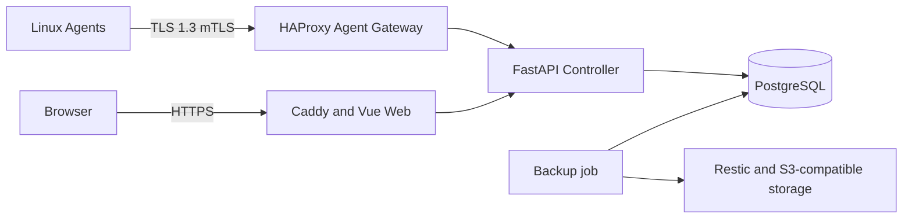

# VPS Guardian

[English](README.md) | [简体中文](README.zh-CN.md)

VPS Guardian 是一个以安全为核心的 Linux VPS 集群监控、诊断与恢复控制平面，由 FastAPI Controller、PostgreSQL、Vue 运营面板和使用双向 TLS 的轻量 Go Agent 组成。

> **这是 Alpha / Developer Preview 版本，尚不建议用于生产环境。**


## 功能

- Controller、Web Dashboard、PostgreSQL 和 Linux Agent
- mTLS、RBAC、TOTP、CSRF 防护与登录限流
- 签名任务、Nonce 防重放、审批和追加式审计事件
- Agent 心跳、CPU 与网络指标及持久化离线队列
- Restic + S3 兼容存储备份恢复，包括 Cloudflare R2
- 覆盖主机、拓扑、灾备、安全、告警和审计的 Operations Overview
- Dashboard、核心文档、日期、数字和状态提示均支持 English / 简体中文

## 当前限制

- 尚未完成大规模多 VPS 长期运行验证
- 尚无 Telegram / 邮件告警闭环
- 服务级监控及自动审批修复流程仍不完整
- 尚无跨云自动重建和生产级公网部署
- Windows SSH Dashboard 启动脚本仍为 Experimental

## 架构



详见[架构说明](docs/zh-CN/ARCHITECTURE.md)。

## 快速安装

需要 Docker Engine 27+、Docker Compose v2、Git、OpenSSL、Python 3 和两个域名。Developer Preview 建议至少 2 核 CPU、4 GB 内存和 20 GB 可用磁盘。

```sh
git clone https://github.com/liumingxu0122-hue/vps-guardian.git
cd vps-guardian
cp .env.example .env
sudo sh scripts/generate-controller-secrets.sh ./secrets agents.guardian.example.com
sudo sh scripts/prepare-compose-secrets.sh --secrets-dir "$(pwd)/secrets"
docker compose build && docker compose up -d
docker compose exec -it controller guardian-admin create-user
```

最后一条命令会安全地交互询问管理员邮箱和隐藏密码。禁止把密码写入 argv、`.env`、Git 或日志。公开端口前请阅读[完整快速开始](docs/zh-CN/QUICKSTART.md)。

## Agent 注册

创建主机清单，通过授权 Controller 流程生成短期注册包，安装对应架构的 Agent，并验证心跳、证书序列号、指标和离线队列。参见 [Agent 安装](docs/zh-CN/AGENT_INSTALLATION.md)。

## Dashboard 访问

打开 `https://<GUARDIAN_DOMAIN>/overview`。首次访问时中文浏览器环境选择简体中文，其他环境使用 English；右上角语言选择会持久保存。Windows SSH 启动脚本仍为 Experimental。

## 备份与恢复

使用受限 Secret 文件、Bucket 限定身份、Restic 检查和隔离恢复，并校验文件、SHA-256、Schema 和关键记录。参见[备份与恢复](docs/zh-CN/BACKUP_AND_RESTORE.md)。

## 安全设计

TLS 1.3 mTLS、签名任务、防重放、RBAC、TOTP、CSRF 防护、限流、审批和审计用于缩小影响范围，不能替代主机加固。参见[安全模型](docs/zh-CN/SECURITY_MODEL.md)与[安全策略](SECURITY.md)。

## 路线图

后续将覆盖长期集群验证、告警投递、深度服务监控、受控修复自动化、跨云恢复和生产部署指南。双语功能计划与 Phase 4B 一起发布为 `v0.1.0-alpha.2`。

## 贡献方式

请阅读 [CONTRIBUTING.md](CONTRIBUTING.md)，保持改动范围清晰并添加相应测试；禁止提交真实基础设施数据或凭据。

## License

项目采用 Apache-2.0，第三方组件仍遵循各自许可证，详见 [THIRD_PARTY_NOTICES.md](THIRD_PARTY_NOTICES.md)。
