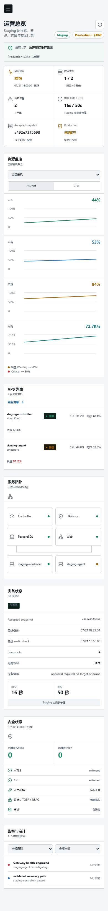
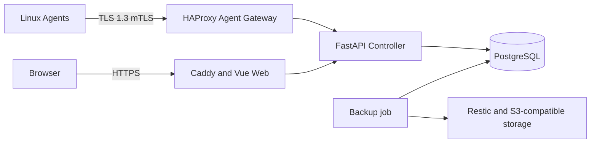

# VPS Guardian

[English](README.md) | [简体中文](README.zh-CN.md)

[](https://github.com/liumingxu0122-hue/vps-guardian/actions/workflows/ci.yml)
[](https://github.com/liumingxu0122-hue/vps-guardian/releases)
[](LICENSE)

VPS Guardian 是一个以安全为核心的 Linux VPS 集群监控、诊断与恢复控制平面，由 FastAPI Controller、PostgreSQL、Vue 运营面板和使用双向 TLS 的轻量 Go Agent 组成。

> **Alpha 警告：** 这是 Developer Preview，尚不建议用于生产环境。



## 项目状态

| 领域 | Alpha 能力 | 状态 |
| --- | --- | --- |
| 控制平面 | FastAPI Controller 与 PostgreSQL 状态存储 | 可用 |
| 受管主机 | Go Agent、多主机清单、服务检查、指标和离线队列 | 可用 |
| 运营界面 | 支持 English / 简体中文的响应式 Overview | 可用 |
| 灾难恢复 | Restic、S3 兼容存储与隔离恢复验证 | 预览 |
| 生产就绪 | 公网部署与多 VPS 长期运行验证 | 未完成 |

## 功能

- Controller、Web Dashboard、PostgreSQL 和 Linux Agent
- TLS 1.3 mTLS、RBAC、TOTP、CSRF 防护与登录限流
- 签名任务、Nonce 防重放、审批和追加式审计事件
- Agent 心跳、CPU 与网络指标及持久化离线队列
- Restic + S3 兼容存储备份恢复，包括 Cloudflare R2
- 覆盖主机、拓扑、灾备、安全、告警和审计的 Operations Overview
- Phase 4B 多主机清单、服务检查、持久告警、可选通知和带审批的修复
- 主机绑定 CSR Bootstrap、Agent 本地生成密钥和受限证书续签
- English / 简体中文界面、文档、日期、数字、时长、状态和错误提示

## 当前限制

- 尚未完成大规模多 VPS 长期运行验证
- Telegram、SMTP 和 Webhook 外发默认关闭，测试仅使用本地 mock
- CSR Bootstrap 已实现，但双主机 staging 验收和持续轮换观察仍为 Pending
- 尚无跨云自动重建和生产级公网部署
- Windows SSH Dashboard 启动脚本仍为 Experimental

## 架构



有关信任边界和数据流，请阅读[架构说明](docs/zh-CN/ARCHITECTURE.md)；监控工作流参见 [Phase 4B 运维说明](docs/zh-CN/PHASE4B.md)；CSR Bootstrap 和验收状态参见 [Phase 4C Staging 说明](docs/zh-CN/PHASE4C.md)。

## 快速安装

Developer Preview 的实用基线为 Docker Engine 27+、Docker Compose v2、Git、OpenSSL、Python 3、两个 DNS 名称、2 核 CPU、4 GB 内存和 20 GB 可用磁盘。

```sh
git clone https://github.com/liumingxu0122-hue/vps-guardian.git
cd vps-guardian
cp .env.example .env
sudo sh scripts/generate-controller-secrets.sh ./secrets agents.guardian.example.com
sudo sh scripts/prepare-compose-secrets.sh --secrets-dir "$(pwd)/secrets"
docker compose build && docker compose up -d
docker compose exec -it controller controller-entrypoint guardian-admin create-user
```

最后一条命令会安全地交互询问管理员邮箱和隐藏密码。禁止把密码写入 argv、`.env`、Git 或日志。公开端口前请阅读[完整快速开始](docs/zh-CN/QUICKSTART.md)。

## Agent 注册

创建主机清单，通过授权 Controller 流程生成短期注册包，并安装对应架构的 Agent。Agent 会在本机生成私钥和 CSR。随后验证心跳、证书序列号、指标和离线队列。参见 [Agent 安装](docs/zh-CN/AGENT_INSTALLATION.md)。

## Dashboard 访问

打开 `https://<GUARDIAN_DOMAIN>/overview`。中文浏览器环境首次访问时选择简体中文，其他语言环境使用 English；语言选择器会持久保存手动选择。Windows SSH 启动脚本仍为 Experimental。

## 备份与恢复

使用受限 Secret 文件、Bucket 限定身份、Restic 检查和隔离恢复，并校验文件数量、SHA-256、Schema 和关键记录。参见[备份与恢复](docs/zh-CN/BACKUP_AND_RESTORE.md)。

## 安全设计

TLS 1.3 mTLS、签名任务、防重放、RBAC、TOTP、CSRF 防护、限流、审批和审计用于缩小影响范围，但不能替代主机加固。参见[安全模型](docs/zh-CN/SECURITY_MODEL.md)与[安全策略](SECURITY.md)。

## 路线图

- 验证更大规模多 VPS 集群的长期运行
- 在 staging 完成双主机 CSR Bootstrap、续签和 CRL 拦截验收
- 完成隔离的哪吒运行时基准；未测量值保持 `Pending`
- 增加跨云恢复流程和生产部署指南
- 在 `v0.1.0-alpha.2` 发布双语 Phase 4B 工作

参见[哪吒研究](docs/zh-CN/comparisons/NEZHA_STUDY.md)和[基准计划](docs/zh-CN/comparisons/NEZHA_BENCHMARK.md)。

## 贡献方式

请阅读 [CONTRIBUTING.md](CONTRIBUTING.md)，保持改动范围清晰并添加相应测试；禁止提交真实基础设施数据或凭据。

## License

VPS Guardian 采用 Apache-2.0。第三方组件仍遵循各自许可证，详见 [THIRD_PARTY_NOTICES.md](THIRD_PARTY_NOTICES.md)。
