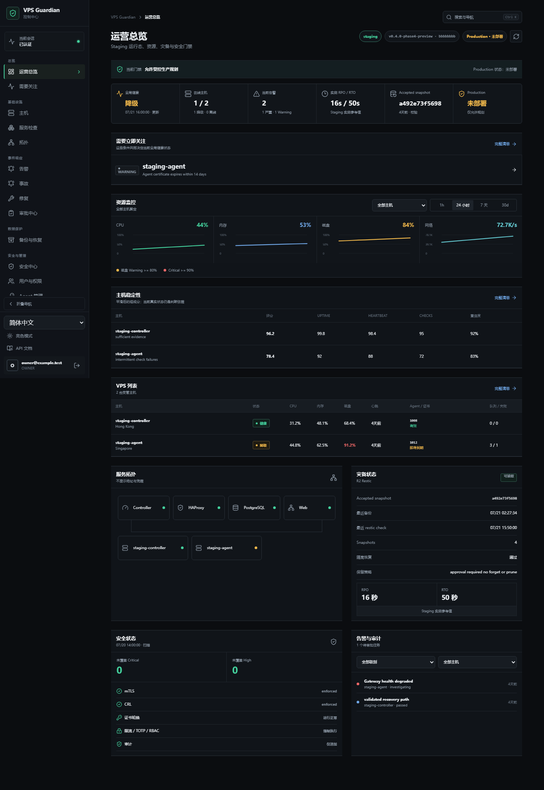
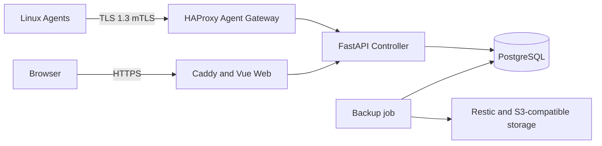

# VPS Guardian

[English](README.md) | [简体中文](README.zh-CN.md)

[](https://github.com/liumingxu0122-hue/vps-guardian/actions/workflows/ci.yml)
[](https://github.com/liumingxu0122-hue/vps-guardian/releases)
[](LICENSE)

VPS Guardian 是一个以安全为核心的 Linux VPS 集群监控、诊断与恢复控制平面，由 FastAPI Controller、PostgreSQL、Vue 运营面板和使用双向 TLS 的轻量 Go Agent 组成。

> **Alpha 警告：** 这是 Developer Preview，尚不建议用于生产环境。



## 项目状态

| 领域 | Alpha 能力 | 状态 |
| --- | --- | --- |
| 控制平面 | FastAPI Controller 与 PostgreSQL 状态存储 | 可用 |
| 受管主机 | Go Agent、多主机清单、服务检查、指标和离线队列 | 可用 |
| 运营界面 | Phase 4 分组控制台、需要关注队列、工作流和中英文 | 预览 |
| 灾难恢复 | Restic、S3 兼容存储与隔离恢复验证 | 预览 |
| 生产就绪 | 公网部署与多 VPS 长期运行验证 | 未完成 |

## 功能

- 预览：按端口精确统计 RX/TX，明确显示数据缺口，使用有上限 PostgreSQL 聚合、
  配额告警及经审批的出站限速

- Controller、Web Dashboard、PostgreSQL 和 Linux Agent
- TLS 1.3 mTLS、RBAC、TOTP、CSRF 防护与登录限流
- 签名任务、Nonce 防重放、审批和追加式审计事件
- Agent 心跳、CPU 与网络指标及持久化离线队列
- Restic + S3 兼容存储备份恢复，包括 Cloudflare R2
- 面向决策的总览与“需要关注”队列，提供可解释健康状态、稳定性组成项和部署来源
- 覆盖主机、检查、拓扑、告警、事故、修复、审批、恢复、安全、用户、Agent、通知、审计和设置的分组响应式控制台
- Phase 4B 多主机清单、服务检查、持久告警、可选通知和带审批的修复
- 告警指派/关闭、带审计事故流转、通知重试/死信记录和结构化检查历史
- Owner/Admin/Operator/Viewer 角色上限、可选收窄 Scope、再认证和 Session 撤销
- 主机绑定 CSR Bootstrap、Agent 本地生成密钥和受限证书续签
- English / 简体中文界面、文档、日期、数字、时长、状态和错误提示

## 当前限制

- 端口流量功能默认关闭；真实 nftables/TC 和 0/1/10/64 策略资源预算仍须在隔离
  Linux Staging 验证

- 尚未完成大规模多 VPS 长期运行验证
- Telegram、SMTP、Discord 和 Webhook 外发默认关闭；真实双通道闭环仍为 Pending
- 双主机 CSR Staging 证据属于历史结果；当前 CRL 握手、轮换和更大集群观察仍需重新验证
- 尚无跨云自动重建和生产级公网部署
- Windows SSH Dashboard 启动脚本仍为 Experimental

## 架构

端口流量预览文档：
[统计](docs/zh-CN/PORT_TRAFFIC_ACCOUNTING.md)、
[安全模型](docs/zh-CN/PORT_TRAFFIC_SECURITY_MODEL.md)、
[运维](docs/zh-CN/PORT_TRAFFIC_OPERATIONS.md)。普通 Agent 安装或升级不会自动启用。


```mermaid
flowchart LR
  A[Linux Agents] -->|TLS 1.3 mTLS| G[HAProxy Agent Gateway]
  G --> C[FastAPI Controller]
  U[Browser] -->|HTTPS| W[Caddy and Vue Web]
  W --> C
  C --> P[(PostgreSQL)]
  B[Backup job] --> P
  B --> R[Restic and S3-compatible storage]
```

有关信任边界和数据流，请阅读[架构说明](docs/zh-CN/ARCHITECTURE.md)；完整工作流和门禁参见 [Phase 4 完成指南](docs/zh-CN/PHASE4_COMPLETION.md)；CSR Bootstrap 和验收状态参见 [Phase 4C Staging 说明](docs/zh-CN/PHASE4C.md)。

## 快速安装

Developer Preview 的实用基线为 Docker Engine 27+、Docker Compose v2、Git、OpenSSL、Python 3、两个 DNS 名称、2 核 CPU、4 GB 内存和 20 GB 可用磁盘。

```sh
git clone https://github.com/liumingxu0122-hue/vps-guardian.git
cd vps-guardian
cp .env.example .env
sudo sh scripts/generate-controller-secrets.sh ./secrets agents.guardian.example.com
sudo sh scripts/prepare-compose-secrets.sh --secrets-dir "$(pwd)/secrets"
docker compose build && docker compose up -d
docker compose exec -it controller controller-entrypoint guardian-admin create-user
```

最后一条命令会安全地交互询问管理员邮箱和隐藏密码。禁止把密码写入 argv、`.env`、Git 或日志。公开端口前请阅读[完整快速开始](docs/zh-CN/QUICKSTART.md)。

## Agent 注册

Admin 或 Owner 可在 **主机 → 添加服务器** 中创建与 Host 绑定的 10 分钟注册会话，并复制一条已校验、固定版本的安装命令。Agent 在本机生成私钥和 CSR，Controller 只保存凭据摘要。固定资源地址和 SHA-256 未配置前功能保持关闭。参见 [Agent 一条命令注册](docs/zh-CN/ONE_COMMAND_AGENT_ENROLLMENT.md)和[手工 Agent 安装](docs/zh-CN/AGENT_INSTALLATION.md)。

完整命令由页面生成；下面仅展示不可直接运行的占位结构：

```sh
umask 077; guardian_tmp="$(mktemp -d)" && \
  curl --fail --show-error --location --proto '=https' \
  https://downloads.example.invalid/v0.4.0/install-agent.sh
```

页面生成的真实命令还会在执行前校验精确 SHA-256，并通过 root-only 临时文件传入短期 `<ONE_TIME_ENROLLMENT_TOKEN>`。

## Dashboard 访问

打开 `https://<GUARDIAN_DOMAIN>/overview` 并登录。管理面板和 API 不提供匿名降级。中文浏览器环境首次访问时选择简体中文，其他语言环境使用 English；语言选择器会持久保存手动选择。Windows SSH 启动脚本仍为 Experimental。

## 备份与恢复

使用受限 Secret 文件、Bucket 限定身份、Restic 检查和隔离恢复，并校验文件数量、SHA-256、Schema 和关键记录。参见[备份与恢复](docs/zh-CN/BACKUP_AND_RESTORE.md)。

## 安全设计

TLS 1.3 mTLS、签名任务、防重放、RBAC、TOTP、CSRF 防护、限流、审批和审计用于缩小影响范围，但不能替代主机加固。参见[安全模型](docs/zh-CN/SECURITY_MODEL.md)与[安全策略](SECURITY.md)。

候选身份恢复闭环见[身份恢复](docs/zh-CN/IDENTITY_RECOVERY.md)。该文档不构成
在线迁移或部署授权。

## 路线图

- 验证更大规模多 VPS 集群的长期运行
- 将已完成的双主机 CSR、续签和 CRL staging 门禁扩展为更长周期的集群耐久性验证
- 完成隔离的哪吒运行时基准；未测量值保持 `Pending`
- 增加跨云恢复流程和生产部署指南
- 在进入 Beta 前稳定 `v0.3.0-alpha.1` 的证书生命周期、服务检查和审批流程

参见[哪吒 2.3.0 对比](docs/comparison/nezha-2.3.0.md)、[观察计划](docs/phase4/observation-run.md)和[生产门禁](docs/phase4/production-gate.md)。未测量值保持 `Pending`；生产结论为 `NO-GO`。

## 贡献方式

请阅读 [CONTRIBUTING.md](CONTRIBUTING.md)，保持改动范围清晰并添加相应测试；禁止提交真实基础设施数据或凭据。

## License

VPS Guardian 采用 Apache-2.0。第三方组件仍遵循各自许可证，详见 [THIRD_PARTY_NOTICES.md](THIRD_PARTY_NOTICES.md)。
