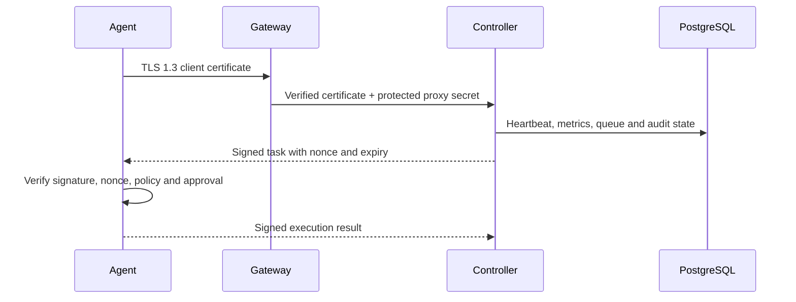

# Architecture

VPS Guardian separates browser traffic, Agent traffic, control logic, and durable state.

## Components

- **Web** builds the Vue application and serves it through Caddy. Caddy terminates browser HTTPS and proxies API requests to the Controller.
- **Agent gateway** is HAProxy with TLS 1.3 and required client certificates. It strips untrusted identity headers and attaches verified certificate material.
- **Controller** authenticates users and Agents, stores state, evaluates health, signs tasks, records approvals and audit events, and exposes the API.
- **PostgreSQL** stores durable control-plane state.
- **Agent** collects host metrics, queues events while offline, verifies signed work, and executes only allowlisted actions.
- **Backup job** creates database-aware Restic snapshots in a local or S3-compatible repository.

## Trust boundaries

Browser sessions use secure cookies, CSRF validation, RBAC, optional TOTP, and rate-limited authentication. Agents use a private CA, short-lived identities, certificate revocation, a controller signing key, and per-Agent signing keys. The public browser endpoint never accepts Agent identity headers as proof.

Secrets are mounted as files. Runtime containers are read-only, drop Linux capabilities, and run as non-root where practical. Network segmentation prevents direct public access to PostgreSQL and Controller ports.

## Data and recovery

PostgreSQL and controller state use named volumes. Backups produce Restic snapshots and are intentionally separate from application startup. Restore is a controlled operator workflow; there is no unapproved delete, forget, or prune action in the Web UI.
