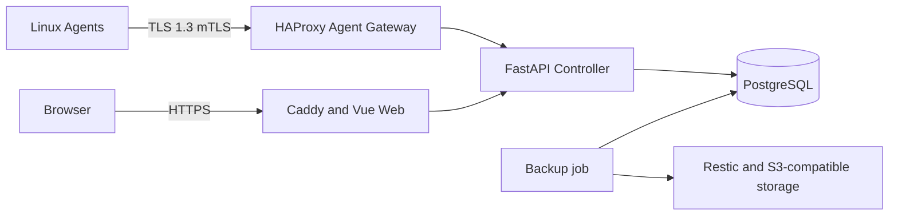

# Architecture

[English](ARCHITECTURE.md) | [简体中文](../zh-CN/ARCHITECTURE.md)

VPS Guardian separates the browser plane, Controller API, Agent ingress, durable state, and backup repository.

Agents send heartbeats, inventory, resource samples, and durable queued results. The Controller owns identity, authorization, signed tasks, approvals, audit events, and recovery metadata. PostgreSQL is authoritative state. The Web application is a least-privilege API client and does not embed infrastructure secrets.

Agent ingress requires certificate identity and replay-resistant signed messages. High-risk actions require RBAC, approval, confirmation, and audit. The current Compose topology is suitable for evaluation; production HA, multi-region rebuilding, and large-fleet validation remain future work.
