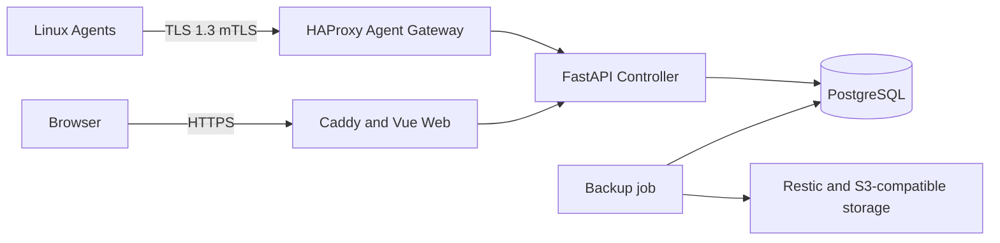

# Architecture

[English](ARCHITECTURE.md) | [简体中文](../zh-CN/ARCHITECTURE.md)

VPS Guardian separates the browser plane, Controller API, Agent ingress, durable state, and backup repository.

```mermaid
flowchart LR
  A[Linux Agents] -->|TLS 1.3 mTLS| G[HAProxy Agent Gateway]
  G --> C[FastAPI Controller]
  U[Browser] -->|HTTPS| W[Caddy and Vue Web]
  W --> C
  C --> P[(PostgreSQL)]
  B[Backup job] --> P
  B --> R[Restic and S3-compatible storage]
```

Agents send heartbeats, inventory, resource samples, and durable queued results. The Controller owns identity, authorization, signed tasks, approvals, audit events, and recovery metadata. PostgreSQL is authoritative state. The Web application is a least-privilege API client and does not embed infrastructure secrets.

Phase 4 keeps current state separate from historical reliability. Overview/Attention derive actionable
health from registered enabled hosts, active alerts/incidents, approval, notification, certificate,
and recovery state. Stability APIs compute separate 1h/24h/7d/30d components with evidence
confidence. Collection endpoints are paginated or bounded; Web routes stay lazy-loaded and GET
requests can be deduplicated/cancelled without increasing Agent sampling.

Agent ingress requires certificate identity and replay-resistant signed messages. High-risk actions require RBAC, approval, confirmation, and audit. The current Compose topology is suitable for evaluation; production HA, multi-region rebuilding, and large-fleet validation remain future work.

See the [Phase 4 completion guide](PHASE4_COMPLETION.md) and
[security threat model](../phase4/security-threat-model.md).
