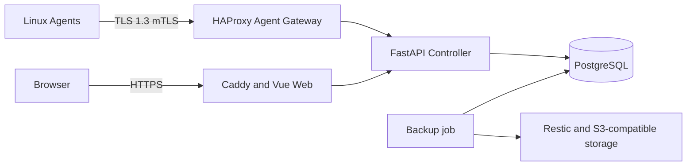

# 架构

[English](../en/ARCHITECTURE.md) | [简体中文](ARCHITECTURE.md)

VPS Guardian 将浏览器平面、Controller API、Agent 入口、持久化状态和备份仓库分离。

Agent 上报心跳、清单、资源样本和持久化离线队列结果。Controller 负责身份、授权、签名任务、审批、审计事件和恢复元数据；PostgreSQL 是权威状态源。Web 仅作为最小权限 API 客户端，不嵌入基础设施 Secret。

Agent 入口要求证书身份和可防重放的签名消息。高风险动作必须经过 RBAC、审批、二次确认和审计。当前 Compose 拓扑适合评估；生产 HA、跨区域重建和大规模节点长期验证仍属后续工作。
