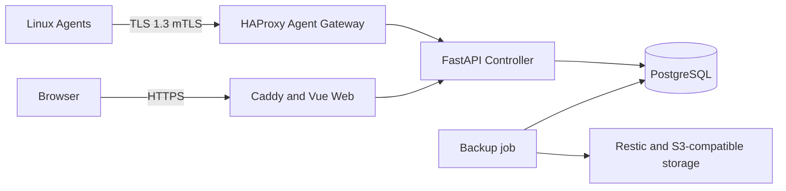

# 架构

[English](../en/ARCHITECTURE.md) | [简体中文](ARCHITECTURE.md)

VPS Guardian 将浏览器平面、Controller API、Agent 入口、持久化状态和备份仓库分离。

```mermaid
flowchart LR
  A[Linux Agents] -->|TLS 1.3 mTLS| G[HAProxy Agent Gateway]
  G --> C[FastAPI Controller]
  U[Browser] -->|HTTPS| W[Caddy and Vue Web]
  W --> C
  C --> P[(PostgreSQL)]
  B[Backup job] --> P
  B --> R[Restic and S3-compatible storage]
```

Agent 上报心跳、清单、资源样本和持久化离线队列结果。Controller 负责身份、授权、签名任务、审批、审计事件和恢复元数据；PostgreSQL 是权威状态源。Web 仅作为最小权限 API 客户端，不嵌入基础设施 Secret。

Phase 4 把当前状态和历史稳定性分开。总览/需要关注根据已注册且启用的主机、活跃告警/事故、
审批、通知、证书和恢复状态计算可行动健康结论。稳定性 API 分别计算 1h/24h/7d/30d
组成项和证据置信度。集合接口采用分页或结果上限；Web 路由保持懒加载，GET 请求可去重和
取消，不提高 Agent 采样频率。

Agent 入口要求证书身份和可防重放的签名消息。高风险动作必须经过 RBAC、审批、二次确认和审计。当前 Compose 拓扑适合评估；生产 HA、跨区域重建和大规模节点长期验证仍属后续工作。

参见 [Phase 4 完成指南](PHASE4_COMPLETION.md)和
[安全威胁模型](../phase4/security-threat-model.md)。
